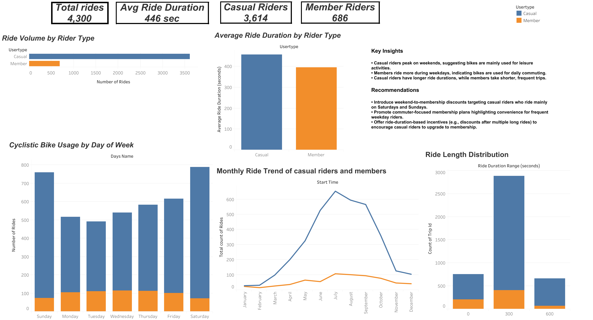

## Cyclistic Bike Share Analysis: Converting Casual Riders to Members
This project analyzes **Cyclistic bike-share data** to understand behavioral differences between **casual riders** and **annual members**.
The goal is to identify **data-driven strategies** that can help the company convert casual riders into **profitable annual memberships**.
The analysis explores riding patterns, trip duration, and weekday vs weekend usage to uncover insights that support marketing and business decisions.

**Tools used:** Excel, BigQuery SQL, and Tableau.


---
## Project Overview

This project analyzes Cyclistic bike-share data to understand how **casual riders** and **members** use the service differently.
The goal is to identify patterns that help the company convert **casual riders into annual members**.


Table of contents

# 📑 Table of Contents

1. [Business Problem](#-business-problem)
2. [Dataset](#-dataset)
3. [Tools Used](#-tools-used)
4. [Data Cleaning in BigQuery](#-data-cleaning-in-bigquery)
5. [SQL Analysis](#-sql-analysis)
6. [Key Insights](#-key-insights)
7. [Dashboard](#-dashboard)
8. [Business Recommendations](#-business-recommendations)
9. [Project Structure](#-project-structure)

---

# Business Problem

Cyclistic wants to increase the number of **annual memberships**.

Annual members are more profitable than casual riders, so the marketing team wants to understand:

- How casual riders and members behave differently ?
- When casual riders ride the most ?
- What strategies can convert casual riders into members ?

---

# 📂 Dataset

The dataset contains bike-share trip records including:

- ride_id
- rideable_type
- start_time
- end_time
- station names
- usertype (Customer / Subscriber)

The dataset was cleaned and processed using **BigQuery**.

---

# Tools Used

| Tool | Purpose |
|-----|------|
| Excel | Initial exploration |
| BigQuery | Data cleaning & SQL analysis |
| Tableau | Data visualization |
| GitHub | Project portfolio |

---

#  Data Cleaning in BigQuery

To prepare the dataset for analysis, a cleaned view was created.

This step:

- removed invalid trips
- calculated ride duration
- created weekday information

### Create Cleaned Trips View

```sql
CREATE OR REPLACE VIEW `primal-chariot-479401-i4.divvy_trip_2019_q4.v_trips_2019_clean` AS

SELECT
    *,

    -- ride length (same as Excel calculation)
    TIMESTAMP_DIFF(end_time, start_time, MINUTE) AS ride_length,

    -- day of week
    FORMAT_DATE('%A', DATE(start_time)) AS day_of_week

FROM `primal-chariot-479401-i4.divvy_trip_2019_q4.trips_2019_all`
WHERE end_time > start_time;
### Overall Ride Summary

This query generates overall statistics for the dataset, including total rides and ride duration metrics.

```sql
CREATE OR REPLACE TABLE `primal-chariot-479401-i4.divvy_trip_2019_q4.summary_overall` AS

SELECT
    COUNT(*) AS total_rides,
    AVG(duration_sec) AS avg_ride_sec,
    MIN(duration_sec) AS min_ride_sec,
    MAX(duration_sec) AS max_ride_sec

FROM `primal-chariot-479401-i4.divvy_trip_2019_q4.trips_2019_clean`;

---

### Average Ride Duration by User Type and Day

This query calculates the average ride duration for members and casual riders for each day of the week.

```sql
CREATE OR REPLACE TABLE `primal-chariot-479401-i4.divvy_trip_2019_q4.trend_avg_ride_by_usertype_day` AS

SELECT
    day_of_week,

    CASE
        WHEN usertype = 'Subscriber' THEN 'member'
        WHEN usertype = 'Customer' THEN 'casual'
        ELSE 'unknown'
    END AS member_type,

    AVG(duration_sec) AS avg_duration_sec

FROM `primal-chariot-479401-i4.divvy_trip_2019_q4.trips_2019_clean`

GROUP BY day_of_week, member_type
ORDER BY day_of_week, member_type;

---


### Total Rides by Day of Week

This query summarizes the total number of rides and average ride duration for each weekday.

```sql
CREATE OR REPLACE TABLE `primal-chariot-479401-i4.divvy_trip_2019_q4.summary_day` AS

SELECT
    day_of_week,
    COUNT(*) AS total_rides,
    AVG(duration_sec) AS avg_ride_sec

FROM `primal-chariot-479401-i4.divvy_trip_2019_q4.trips_2019_clean`

GROUP BY day_of_week;

---

### Ride Count by Member Type and Day

This query compares ride activity between members and casual riders across different days of the week.

```sql
CREATE OR REPLACE TABLE `primal-chariot-479401-i4.divvy_trip_2019_q4.summary_member_day` AS

SELECT
    usertype AS member_type,
    day_of_week,
    COUNT(*) AS total_rides,
    AVG(duration_sec) AS avg_ride_sec

FROM `primal-chariot-479401-i4.divvy_trip_2019_q4.trips_2019_clean`

GROUP BY member_type, day_of_week;

---

### Member vs Casual Ride Comparison

This query compares the total number of rides taken by members and casual riders.

```sql
CREATE OR REPLACE TABLE `primal-chariot-479401-i4.divvy_trip_2019_q4.trend_member_vs_casual_users` AS

SELECT

    CASE
        WHEN usertype = 'Subscriber' THEN 'member'
        WHEN usertype = 'Customer' THEN 'casual'
        ELSE 'unknown'
    END AS member_type,

    COUNT(*) AS total_rides

FROM `primal-chariot-479401-i4.divvy_trip_2019_q4.trips_2019_clean`

GROUP BY member_type
ORDER BY total_rides DESC;

---

### Weekday Ride Trend by Member Type

This query analyzes ride frequency for members and casual riders across different weekdays.

```sql
CREATE OR REPLACE TABLE `primal-chariot-479401-i4.divvy_trip_2019_q4.trend_weekday_ride_by_member_casual` AS

SELECT
    day_of_week,

    CASE
        WHEN usertype = 'Subscriber' THEN 'member'
        WHEN usertype = 'Customer' THEN 'casual'
        ELSE 'unknown'
    END AS member_type,

    COUNT(*) AS total_rides

FROM `primal-chariot-479401-i4.divvy_trip_2019_q4.trips_2019_clean`

GROUP BY day_of_week, member_type
ORDER BY day_of_week, member_type;

---

### Most Common Ride Day (Mode)

This query identifies the most frequently occurring weekday for bike rides.

```sql
CREATE OR REPLACE TABLE `primal-chariot-479401-i4.divvy_trip_2019_q4.trips_2019_summary` AS

SELECT
    AVG(duration_sec) AS avg_duration_sec,
    MAX(duration_sec) AS max_duration_sec,

(
    SELECT day_of_week
    FROM `primal-chariot-479401-i4.divvy_trip_2019_q4.trips_2019_clean`
    GROUP BY day_of_week
    ORDER BY COUNT(*) DESC
    LIMIT 1
) AS mode_day

FROM `primal-chariot-479401-i4.divvy_trip_2019_q4.trips_2019_clean`;
```
---
# 📊 Key Insights

Based on the SQL analysis, several patterns were identified between **casual riders** and **members**.

### 1. Riding Patterns
Casual riders tend to ride more frequently on **weekends**, suggesting leisure-based usage.

Members ride more consistently during **weekdays**, which suggests commuting or routine travel.

### 2. Ride Duration
Casual riders generally have **longer ride durations** compared to members.

This indicates that casual riders are more likely using bikes for **recreational purposes**.

### 3. Weekly Usage Trends
Weekday ride counts are dominated by **members**, while weekend usage is more balanced between both groups.

This highlights an opportunity to target casual riders during peak leisure periods.

---

# 📈 Dashboard

The final analysis was visualized using **Tableau dashboards** to compare riding behavior between **casual riders** and **members**.

The dashboard highlights:

- Ride distribution between **members and casual riders**
- Ride frequency across **days of the week**
- Differences in **average ride duration**
- Weekly usage patterns between **commuters and leisure riders**
  
### Dashboard Insights

From the visualization:

• Casual riders peak on **weekends**, indicating leisure usage  
• Members ride more frequently during **weekdays**, suggesting commuting behavior  
• Casual riders tend to have **longer ride durations**

### Dashboard Preview



### Interactive Dashboard

Explore the full interactive dashboard here:

🔗 https://public.tableau.com/app/profile/jeewan.gurung/viz/CyclisticBikeShareCasualvsMemberBehaviorAnalysis/Dashboard2
